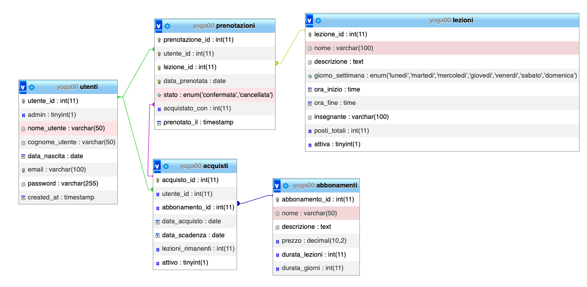

# White Yoga

**Gestione studio yoga** – Progetto esame *Tecnologie Web: Approcci avanzati* (CPS0547)

**Autore**: Bianchi Andrea  
**Matricola**: 954122  
**Anno accademico**: 2025/2026


---

## Descrizione del progetto
L'obiettivo del progetto è realizzare un'applicazione web per permettere la gestione degli abbonamenti e delle lezioni di una scuola di yoga.

---

## Note preliminari
Al fine del progetto d'esame le classi CRUD completamente implementate sia lato backend che lato frontend sono solo quelle relative alla classe **Lezione**.

Le altre classi (Utente, Abbonamento, Acquisto, Prenotazione) sono state implementate solo parzialmente, con funzionalità limitate.


## Credenziali di prova
Le credenziali per accedere agli account per testare le funzionalità sono i seguenti:

Utente generico
email => tajin.miao@yoga.it 
password => tajin01!

Utente Admin
email => admin02@yoga.it
password => admin_admin


## Progettazione del database
Come primo passo del progetto parto dal definire la struttura del mio database.
Il database è un modello relazionale. 
Utilizza MySQL  con charset "utf8mb4" per il supporto unicode.

 **Le entità che devono essere rappresentante nel database sono:**

### **UTENTI** – Gestione utenti e autenticazione
Rappresentano le persone che usano la web app.
Possono essere admin (insegnanti della scuola) o utenti generici (i clienti della scuola)

| Campo              | Tipo                  | Descrizione                              | Constraint          |
|--------------------|-----------------------|------------------------------------------|---------------------|
| utente_id          | INT AUTO_INCREMENT    | ID univoco utente                        | PRIMARY KEY         |
| admin              | TINYINT(1) DEFAULT 0  | 1 = amministratore, 0 = utente normale   | NOT NULL            |
| nome_utente        | VARCHAR(50)           | Nome                                     | NOT NULL            |
| cognome_utente     | VARCHAR(50)           | Cognome                                  | NOT NULL            |
| data_nascita       | DATE                  | Data di nascita                          | NOT NULL            |
| email              | VARCHAR(100)          | Email (univoca)                          | NOT NULL, UNIQUE    |
| password           | VARCHAR(255)          | Password hashata                         | NOT NULL            |
| created_at         | TIMESTAMP             | Data creazione account                   |                     |  


### **ABBONAMENTI** – Tipologie di abbonamento
Rappresentano i tipi di abbonamenti che la scuola offre ai propri clienti.
Alcuni tipi di abbonamento hanno una validità temporale (per esempio mensile o trimestrale)
Altri abbonamenti hanno una durata in termini di numero di lezioni che si possono frequentare (10 ingressi)

| Campo                  | Tipo                  | Descrizione                                | Constraint        |
|------------------------|-----------------------|--------------------------------------------|-------------------|
| abbonamento_id         | INT AUTO_INCREMENT    | ID univoco                                 | PRIMARY KEY       |
| nome                   | VARCHAR(50)           | Nome abbonamento (es. "Open Card 10")      | NOT NULL          |
| descrizione            | TEXT                  | Descrizione dettagliata                    |                   |
| prezzo                 | DECIMAL(10,2)         | Prezzo in euro                             | NOT NULL          |
| durata_lezioni         | INT                   | Numero lezioni incluse (NULL = illimitato) |                   |
| durata_giorni          | INT                   | Validità in giorni (NULL = a lezioni)      |                   |


### **ACQUISTI** – Acquisti di abbonamenti da parte degli utenti
memorizza tutti gli acquisti effettuati dagli utenti

| Campo                  | Tipo                  | Descrizione                       | Constraint                  |
|------------------------|-----------------------|-----------------------------------|-----------------------------|
| acquisto_id            | INT AUTO_INCREMENT    | ID univoco acquisto               | PRIMARY KEY                 |
| utente_id              | INT                   | Riferimento utente                | FOREIGN KEY → utenti        |
| abbonamento_id         | INT                   | Tipo abbonamento acquistato       | FOREIGN KEY → abbonamenti   |
| data_acquisto          | DATE                  | Data acquisto                     | NOT NULL                    |
| data_scadenza          | DATE                  | Data scadenza (calcolata)         |                             |
| lezioni_rimanenti      | INT                   | Lezioni residue (per pacchetti)   |                             |
| attivo                 | TINYINT(1) DEFAULT 1  | 1 = attivo, 0 = scaduto           | NOT NULL                    |


### **LEZIONI** – Orario settimanale delle lezioni
le lezioni che la scuola propone, alle quali i clienti si possono iscrivere per prenotare il proprio posto.

| Campo                  | Tipo                  | Descrizione                         | Constraint            |
|------------------------|-----------------------|-------------------------------------|-----------------------|
| lezione_id             | INT AUTO_INCREMENT    | ID univoco lezione                  | PRIMARY KEY           |
| nome                   | VARCHAR(100)          | Nome lezione (es. "Hatha Yoga")     | NOT NULL              |
| descrizione            | TEXT                  | Descrizione                         |                       |
| giorno_settimana       | ENUM(...)             | Giorno fisso settimanale            | NOT NULL              |
| ora_inizio / ora_fine  | TIME                  | Orario inizio/fine                  | NOT NULL              |
| insegnante             | VARCHAR(100)          | Nome insegnante                     |                       |
| posti_totali           | INT DEFAULT 20        | Capacità massima sala               | NOT NULL              |
| attiva                 | TINYINT(1) DEFAULT 1  | 1 = visibile/prenotabile            | NOT NULL              |


### **PRENOTAZIONI** – Prenotazioni singole degli utenti
Prenotazioni: gestisce le prenotazioni alle lezioni degli utenti.

| Campo                  | Tipo                            | Descrizione                        | Constraint                        |
|------------------------|---------------------------------|------------------------------------|-----------------------------------|
| prenotazione_id        | INT AUTO_INCREMENT              | ID univoco                         | PRIMARY KEY                       |
| utente_id              | INT                             | Chi ha prenotato                   | FOREIGN KEY → utenti              |
| lezione_id             | INT                             | Lezione prenotata                  | FOREIGN KEY → lezioni             |
| data_prenotata         | DATE                            | Data specifica della lezione       | NOT NULL                          |
| stato                  | ENUM('confermata','cancellata') | Stato prenotazione                 | DEFAULT 'confermata'              |
| acquistato_con         | INT                             | Abbonamento usato (se applicabile) | FOREIGN KEY → acquisti (SET NULL) |
| prenotato_il           | TIMESTAMP                       | Data/ora prenotazione              | DEFAULT CURRENT_TIMESTAMP         |

### SCHEMA DEL DATABASE 

*(Immagine generata con phpMyAdmin)*

*(Il dump completo del database, con record di prova inseriti, è disponibile in `/sql/yoga00.sql`)*


---


## BACKEND - API REST in PHP
Dopo aver definito il database, procedo con la realizzazione del backend.

### Caratteristiche principali:
- **Architettura REST** con endpoint separati per ogni entità
- **Autenticazione basata su sessioni PHP**
- **Autorizzazione** con ruolo admin
- **Validazioni** dei dati in ingresso
- **Gestione errori** con try catch e codici HTTP appropriati
- **Protezione da XSS e SQLi** (htmlspecialchars) e SQL Injection (PDO prepared statements)
- **CORS** configurato per sviluppo locale
- **Documentazione automatica** con phpDocumentor (questo tipo di pratica è la prima volta che la applico in un progetto)

### Struttura del backend
```palaintxt
backend/
├── api/                    # Endpoint pubblici (chiamati dal frontend)
│   ├── auth/               # Gestione autenticazione
│   │   ├── login.php
│   │   ├── logout.php
│   │   └── check_session.php
│   ├── lezioni/
│   ├── prenotazioni/
│   ├── utenti/
│   └── abbonamenti/
├── classes/                # Classi OOP principali
│   ├── Utente.php
│   ├── Lezione.php
│   ├── Prenotazione.php
│   ├── Abbonamento.php
│   └── Acquisto.php
├── database/
│   └── Database.php        # Singleton per connessione PDO
├── utils/
│   ├── utils_api.php       # Funzioni riutilizzabili (handler CRUD, validazioni)
│   ├── utils_session.php   # Gestione sessioni e autenticazione
│   └── cors.php            # Configurazione CORS
└── credenziali.php         # Credenziali DB (da configurare localmente)
```

### Sicurezza implementata
- **Password**: hashate con `password_hash()` (algoritmo bcrypt/PASSWORD_DEFAULT)
- **Input sanitization**: `htmlspecialchars()` su tutti i dati utente
- **Prepared statements**: protezione totale da SQL injection
- **Validazioni**: controlli su lunghezza, formato email, orari, giorni validi

Tutte le API create sono state testate con Postman per verificarne il corretto funzionamento.

### Documentazione
La documentazione delle API è generata automaticamente con phpDocumentor (https://phpdoc.org/) 
e si trova in `documentazione/api_docs/`.
Tale metodo per la creazione della documentazione è stato adottato per la prima volta in questo progetto.
L'argomento è ancora in fase di approfondimento.
plaintext```

---

## FRONTEND - Interfaccia utente con HTML, CSS, Bootstrap e JavaScript


Il frontend è realizzato come Single Page Application (SPA) utilizzando HTML5, CSS3, Bootstrap 5.3 e JavaScript (con jQuery per semplificare alcune operazioni DOM/AJAX).

### Tecnologie utilizzate
- **HTML5** semantico
- **Bootstrap 5.3** per layout responsive e componenti (navbar, cards, modali, form)
- **CSS personalizzato** con variabili (`:root`) per coerenza brand
- **JavaScript vanilla + jQuery** per logica dinamica
- **Font Awesome** per icone
- **Animazioni CSS** (fade-in, hover lift, transizioni fluide)

### Architettura e flusso
- **Caricamento dinamico** delle pagine tramite JavaScript (`innerHTML`)
- **Event delegation** centrale in `listener.js` per gestire elementi creati dinamicamente
- **Gestione stato** con variabile globale `utente_corrente`
- **Navigazione fluida** senza refresh (SPA-like)
- **Responsive** il design si adatta a schermi di differente grandezza.

### Pagine principali

#### Elementi comuni
- Navbar responsive con menu collapsible. Mostra link diversi se utente loggato/admin.
- Footer con info.

#### Homepage
- Hero section full-width con immagine background e overlay
- Sezione benefici con card animate al hover
- Sezione contatti

#### Lista Lezioni
- Card responsive con dettagli (giorno, orario, insegnante, posti)
- Effetti di animazione all'hover
- Pulsanti "Dettaglio" e "Prenota" (se loggato)
- Pulsanti admin: Modifica / Elimina (solo admin)

#### Dettaglio Lezione
- Permette di visualizzare in dettaglio una lezione ed eventualmente prenotare se loggati.
- Layout card centrato con form prenotazione (input date)
- Messaggio chiaro se non loggato

#### Area Personale
- Profilo utente con dati personali
- Storico prenotazioni in card
- Pulsante annulla prenotazione (disabilitato per demo - funzionalità ancora da implementare)


### Struttura del frontend
```plaintext
frontend.
├── assets
│ ├── css
│ │ ├── style_base.css
│ │ ├── style_footer.css
│ │ ├── style_homepage.css
│ │ ├── style_navbar.css
│ │ └── style_variable.css
│ ├── immagini
│ │ ├── Logo_01.png
│ │ ├── Logo_02.png
│ │ └── yoga-hero.png
│ ├── js
│ │ ├── common
│ │ ├── lezioni
│ │ └── prenotazioni
│ └── templates
│     ├── area-personale.js
│     ├── footer.js
│     ├── homepage.js
│     ├── impaginazione.html
│     └── navbar.js
└── index.html
```


